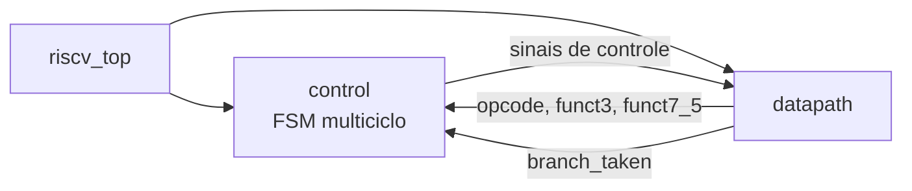
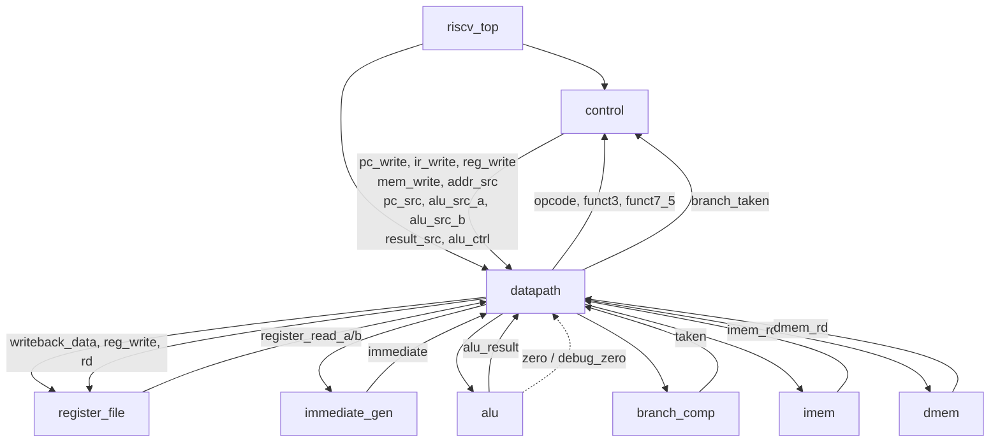
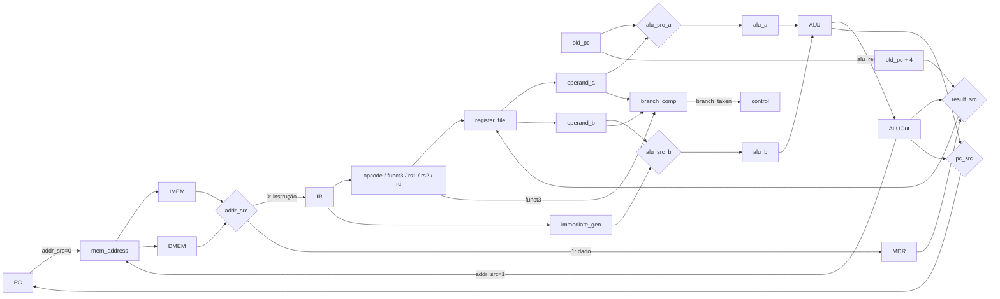
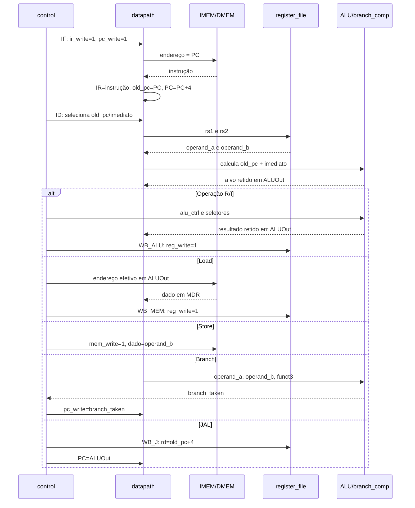
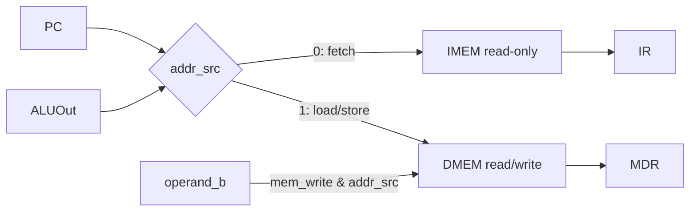
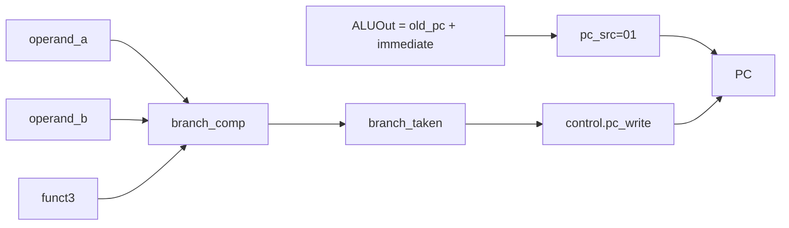
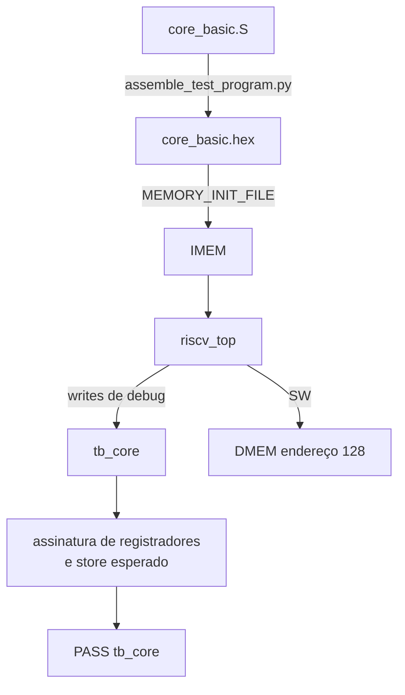

# Fluxo da CPU RISC-V

Este documento é o mapa de leitura do projeto. Ele mostra a hierarquia dos
módulos, os sinais que ligam controle e datapath e o que acontece em cada
estado da CPU multiciclo.

## 1. Visão geral



`riscv_top` não executa operações diretamente. Ele apenas conecta:

- `control`: decide em qual estado a CPU está e gera os sinais de controle;
- `datapath`: contém PC, registradores temporários, ALU, memórias, decoders e
  os caminhos de dados.

A fonte oficial é a lista [`rtl/files.f`](../rtl/files.f).
O export em `legacy/` é preservado para testes de compatibilidade e não faz
parte do build oficial.

## 2. Hierarquia e comunicação entre módulos



### Responsabilidade de cada módulo

| Módulo | Responsabilidade | Entradas principais | Saídas principais |
| --- | --- | --- | --- |
| `riscv_top` | Integra controle e datapath | `clk`, `rst` | Interface da CPU e debug opcional |
| `control` | FSM e sinais de controle | `opcode`, `funct3`, `funct7_5`, `branch_taken` | Escritas, seletores, operação da ALU |
| `datapath` | Transporte e retenção dos dados | Sinais da FSM | Campos da instrução, `branch_taken`, estado observável |
| `alu` | Operações aritméticas/lógicas | `a`, `b`, `alu_ctrl` | `result`, `zero` |
| `branch_comp` | Comparação das seis condições de branch | `operand_a`, `operand_b`, `funct3` | `taken` |
| `register_file` | 32 registradores de 32 bits | `rs1`, `rs2`, `rd`, writeback | Dois operandos lidos |
| `immediate_gen` | Decodificação e extensão de imediatos | `instruction` | Imediato de 32 bits |
| `imem` | Leitura combinacional de instruções | Endereço | Instrução |
| `dmem` | Leitura e escrita de dados | Clock, endereço, dado, `we` | Dado lido |

## 3. Datapath detalhado



Os registradores temporários são atualizados na borda de subida do clock:

- `IR` recebe a instrução durante `IF`;
- `old_pc` recebe o PC da instrução que foi capturada;
- `operand_a` e `operand_b` recebem os valores lidos do banco;
- `ALUOut` recebe o resultado combinacional da ALU;
- `MDR` retém o dado retornado pela DMEM.

O reset é assíncrono e zera PC, `old_pc`, IR, MDR, operandos, `ALUOut` e o
estado da FSM. O banco de registradores e as memórias são inicializados para o
fluxo de laboratório, mas não possuem porta de reset.

## 4. Fluxo de uma instrução



A CPU não é pipeline. Uma instrução ocupa vários ciclos e a FSM avança pelos
estados abaixo:

| Estado | Código | Ação |
| --- | ---: | --- |
| `ST_IF` | 0 | Lê IMEM, captura IR e incrementa PC |
| `ST_ID` | 1 | Lê registradores e calcula imediato/alvo |
| `ST_EX_R` | 2 | Executa operação register-register |
| `ST_EX_I` | 3 | Executa operação com imediato |
| `ST_EX_MEM` | 4 | Calcula endereço efetivo |
| `ST_MEM_RD` | 5 | Seleciona DMEM para leitura |
| `ST_MEM_WR` | 6 | Escreve DMEM |
| `ST_WB_ALU` | 7 | Escreve `ALUOut` no banco |
| `ST_WB_MEM` | 8 | Escreve `MDR` no banco |
| `ST_EX_B` | 9 | Avalia branch e, se tomado, instala o alvo |
| `ST_EX_J` | 10 | Calcula/preserva alvo do `JAL` |
| `ST_WB_J` | 11 | Escreve link e instala o alvo do jump |

## 5. Fetch e separação IMEM/DMEM

`addr_src` escolhe o significado de `mem_address`:



Cada memória tem 256 palavras de 32 bits. O índice usa `addr[9:2]`; os dois
bits menos significativos são ignorados. Não há trap de desalinhamento, faixa
de endereço ou acesso a byte/meia-palavra.

## 6. Branches



`branch_comp` é a decisão funcional do branch:

| `funct3` | Instrução | Comparação |
| --- | --- | --- |
| `000` | `BEQ` | `a == b` |
| `001` | `BNE` | `a != b` |
| `100` | `BLT` | `$signed(a) < $signed(b)` |
| `101` | `BGE` | `$signed(a) >= $signed(b)` |
| `110` | `BLTU` | `a < b` |
| `111` | `BGEU` | `a >= b` |

A flag `zero` ainda é produzida pela ALU para observação e debug. Ela não
decide mais o branch, porque só expressa se o resultado da operação atual da
ALU é zero e não distingue todas as comparações signed/unsigned.

## 7. Jumps e writeback

Para `JAL`:

```text
ID:       ALUOut = old_pc + immediate
WB_J:     rd      = old_pc + 4
          PC      = ALUOut
```

O projeto implementa `JAL`, mas ainda não implementa `JALR`. Portanto, existe
salto com link, mas não existe ainda o retorno padrão `JALR x0, 0(ra)` nem
preservação automática de uma pilha de retornos.

O writeback escolhe entre:

```text
result_src=00 -> ALUOut
result_src=01 -> MDR
result_src=10 -> old_pc + 4
```

Escritas em `x0` são descartadas pelo `register_file`.

## 8. Fluxo do mini firmware

O programa [`core_basic.S`](../tb/support/firmware/core_basic.S)
é montado pelo assembler mínimo em `core_basic.hex` e carregado na IMEM pelo
parâmetro `MEMORY_INIT_FILE`.



O testbench verifica aritmética, lógica, shifts, comparações, `SW/LW`, os seis
branches, `LUI` e `JAL`. O marcador `x31=1` encerra a espera do testbench; o
programa depois fica em um loop `jal x0, done`.

## 9. Como validar e inspecionar

Dentro do devcontainer ou de um Linux com as ferramentas instaladas:

```bash
make setup-check
make lint
make test
make wave TEST=core_basic
make schematic MODULE=riscv_top
make synth
```

Artefatos principais:

- `build/logs/`: logs dos testes e ferramentas;
- `build/sim/core_basic/test-core.vcd`: waveform do teste integrado;
- `build/schematic/riscv_top.svg`: esquema gerado por Yosys + Graphviz;
- `build/synth/`: netlist e JSON da síntese;
- `reports/`: estatísticas e relatórios estáticos.

Para acompanhar uma instrução na waveform, observe nesta ordem:

```text
debug_state
debug_pc / debug_old_pc
debug_instruction e campos de decode
debug_operand_a / debug_operand_b
debug_alu_a / debug_alu_b / debug_alu_result
debug_alu_out
debug_mem_address / debug_mem_write
debug_reg_write / debug_rd / debug_writeback
```

Os sinais de debug são taps de observação e não mudam o comportamento
funcional do processador.
