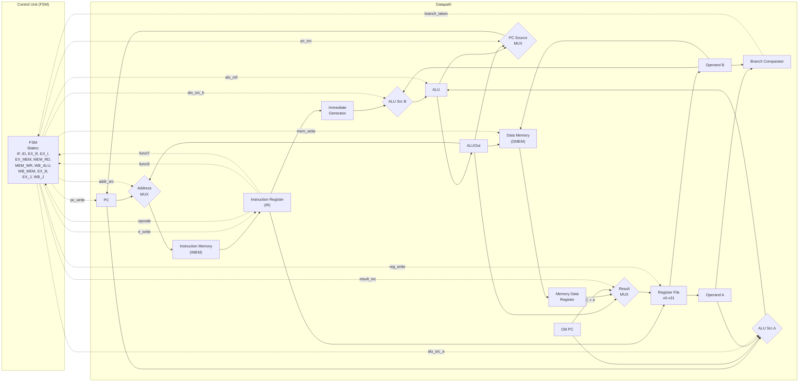

# **Arquitetura Chip RISC-V**

# **1\. Processador**

## **1.1 Diagrama de Blocos**

## **1.2 Descrição do Processador**

O processador desenvolvido utiliza uma arquitetura RISC-V multiciclo, na qual a execução de cada instrução é dividida em múltiplos ciclos de clock. Diferente de um processador monociclo, em que todas as operações ocorrem em um único ciclo, a arquitetura utiliza os mesmos componentes de hardware em etapas distintas, reduzindo a complexidade do circuito e o consumo de recursos.

A operação do processador é coordenada por uma Unidade de Controle (FSM – Finite State Machine) e por um Datapath. A Unidade de Controle é responsável por determinar, a cada ciclo de clock, quais componentes devem ser habilitados e como os dados devem percorrer o datapath. Para isso, ela analisa o opcode, o funct3, o funct7 e o resultado das comparações de desvio, gerando sinais de controle que comandam os multiplexadores, o banco de registradores, as memórias, a ALU e a atualização do contador de programa.

A execução de uma instrução começa na etapa de busca (Instruction Fetch). O registrador Program Counter (PC) fornece o endereço da próxima instrução para a memória de instruções (IMEM). A instrução lida é armazenada no Instruction Register (IR), enquanto o valor atual do PC também é preservado no registrador Old PC, permitindo sua reutilização em instruções como AUIPC, JAL e JALR. Durante essa etapa, a ALU calcula o endereço da próxima instrução (PC \+ 4), preparando o avanço normal da execução.

Na etapa de decodificação (Instruction Decode), os campos da instrução armazenada no IR são utilizados para acessar o Banco de Registradores, que possui duas portas de leitura e uma porta de escrita. O Gerador de Imediatos (Immediate Generator) interpreta o formato da instrução e gera o valor imediato correspondente, realizando a extensão de sinal quando necessário. Também nessa etapa, o Comparador de Branch recebe os operandos lidos do banco de registradores e determina se uma instrução de desvio condicional deve ser executada.

Na etapa de execução (Execute), a ALU (Arithmetic Logic Unit) realiza operações aritméticas e lógicas, como soma, subtração, operações bit a bit, deslocamentos e comparações. Dois multiplexadores permitem selecionar as entradas da ALU entre diferentes fontes, como o PC, o Old PC, os operandos do banco de registradores, constantes e valores imediatos. O resultado produzido é armazenado no registrador ALUOut, que preserva o valor para utilização nas etapas seguintes.

Quando a instrução envolve acesso à memória, o conteúdo de ALUOut é utilizado como endereço da Memória de Dados (DMEM). Para instruções de leitura, o dado obtido é armazenado no Memory Data Register (MDR), enquanto as instruções de escrita utilizam diretamente o segundo operando proveniente do banco de registradores como dado a ser gravado na memória.

Na etapa de escrita de resultado (Write Back), um multiplexador seleciona qual valor será escrito no banco de registradores. Dependendo da instrução, esse valor pode ser o resultado da ALU armazenado em ALUOut, o dado lido da memória armazenado em MDR ou o endereço de retorno (Old PC \+ 4\) utilizado pelas instruções JAL e JALR.

A atualização do Program Counter também é controlada por um multiplexador. Ele permite selecionar entre o endereço sequencial (PC \+ 4), o endereço de destino calculado pela ALU para instruções de desvio e salto, ou, no caso da instrução JALR, o endereço calculado com o bit menos significativo forçado para zero, conforme especificado pela arquitetura RISC-V.

Ao separar a execução em múltiplas etapas controladas pela máquina de estados finitos, o processador reutiliza a ALU, as memórias e o banco de registradores ao longo de diferentes ciclos de clock. Essa organização simplifica o hardware, reduz a quantidade de componentes necessários e facilita a implementação de diferentes instruções, como operações aritméticas, acessos à memória, desvios condicionais e saltos, mantendo compatibilidade com o conjunto de instruções RISC-V implementado no projeto.

# **2\. Instruções Implementadas**

| Instrução | Opcode (binário) | Opcode (hex) |
| :---- | :---- | :---- |
| LOAD | 0000011 | 0x03 |
| OP-IMM | 0010011 | 0x13 |
| AUIPC | 0010111 | 0x17 |
| STORE | 0100011 | 0x23 |
| OP (tipo R) | 0110011 | 0x33 |
| LUI | 0110111 | 0x37 |
| BRANCH | 1100011 | 0x63 |
| JALR | 1100111 | 0x67 |
| JAL | 1101111 | 0x6F |

## **2.1 Instruções de tipo R**

Opcode correspondente: 0x33.

* ADD  
* SUB  
* AND  
* OR  
* XOR  
* SLL  
* SRL  
* SRA  
* SLT  
* SLTU

## **2.2 Instruções de tipo I**

Opcode correspondente: 0x13.

* ADDI  
* ANDI  
* ORI  
* XORI  
* SLLI  
* SRLI  
* SRAI  
* SLTI  
* SLTIU

## **2.3 Instruções de Memória**

Opcode correspondente: 0x03 (Load).

* LW

Opcode correspondente: 0x23 (Write).

* SW

## **2.4 Instruções de Branch**

Opcode correspondente: 0x63.

* BEQ  
* BNE  
* BLT  
* BGE  
* BLTU  
* BGEU

## **2.5 Instruções de Salto**

Opcode correspondente: 0x6F.

* JAL

Opcode correspondente: 0x67.

* JALR

## **2.6 Instruções de tipo U**

Opcode correspondente: 0x37.

* LUI

Opcode correspondente: 0x17.

* AUIPC

# **3\. Fluxo de Uma Instrução de Tipo R**

As instruções do tipo R, como ADD, SUB, AND e OR, são executadas em quatro estados da máquina de estados finita (FSM): IF, ID, EX\_R e WB\_ALU. No estado IF (Instruction Fetch), o processador utiliza o contador de programa (PC) para acessar a memória de instruções (IMEM), armazenando a instrução no registrador IR e incrementando o PC em quatro bytes. Em seguida, no estado ID (Instruction Decode), a instrução é decodificada, os operandos são lidos do banco de registradores e os sinais de controle são preparados. No estado EX\_R (Execute), a Unidade Lógica e Aritmética (ALU) realiza a operação especificada pelos campos `funct3` e `funct7`, produzindo o resultado da operação. Finalmente, no estado WB\_ALU (Write Back), o resultado armazenado no registrador ALUOut é escrito no registrador de destino (`rd`). Após essa etapa, a FSM retorna ao estado IF para buscar a próxima instrução.